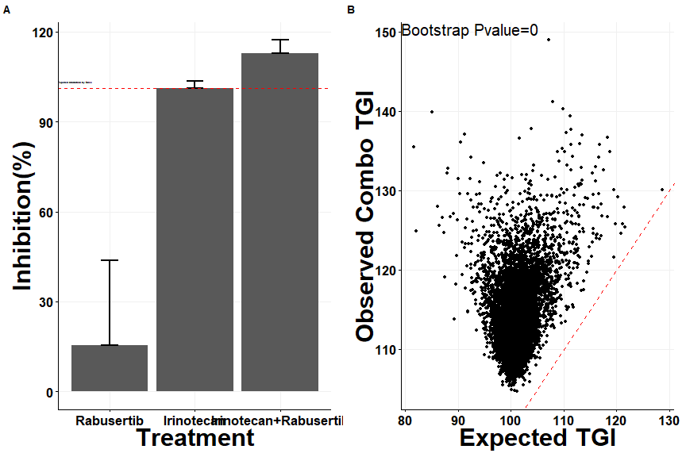
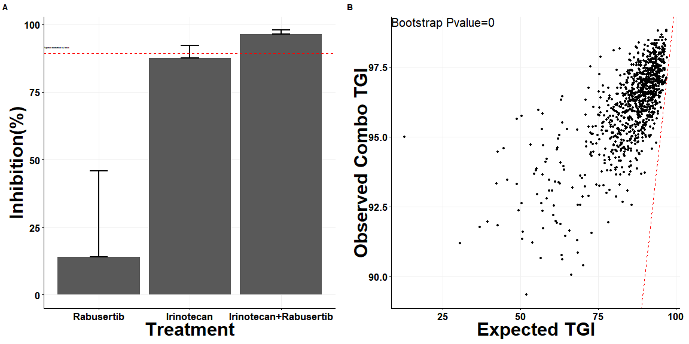
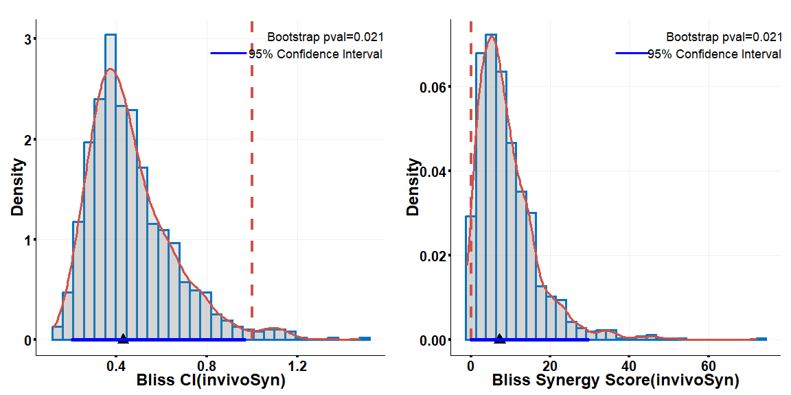

<!-- README.md is generated from README.Rmd. Please edit that file -->

# invivoSyn

<!-- badges: start -->
<!-- badges: end -->

The goal of invivoSyn is to evaluate synergy for in vivo tumor growth
data. Synergy can be calculated based on TGI/AUC based drug effect or
linear mixed model. For effect based efficacy, three reference models
can be selected, which are HSA (Highest Single Agent), Bliss(Bliss
Independence) or RA(Response Addivity).

## Installation

You can install the development version of invivoSyn from
[GitHub](https://github.com/) with:

``` r
# install.packages("devtools")
devtools::install_github("maobinchen/invivoSyn")
```

## Example

This is a basic example which shows you how to do synergy calculation

``` r
library(invivoSyn)
tv <- read_tv(system.file("extdata", "test.csv", package = "invivoSyn"))
TGI_lst <- getTGI(tv,17)
bliss_synergy_TGI <- TGI_synergy(TGI_lst)
```



``` r
TGI_lst_RTV <- getTGI(tv,17,tv_var='RTV') #TGI defition from CombPDX paper
bliss_synergy_TGI_RTV <- TGI_synergy(TGI_lst_RTV)
```



``` r
#global_CI=global_CI_synergy(tv)
AUC_lst <- get_mAUCr(SNU_81, ci = 0.9, ci_type = "bca")
bliss_synergy_AUC <- AUC_synergy(AUC_lst)
```


