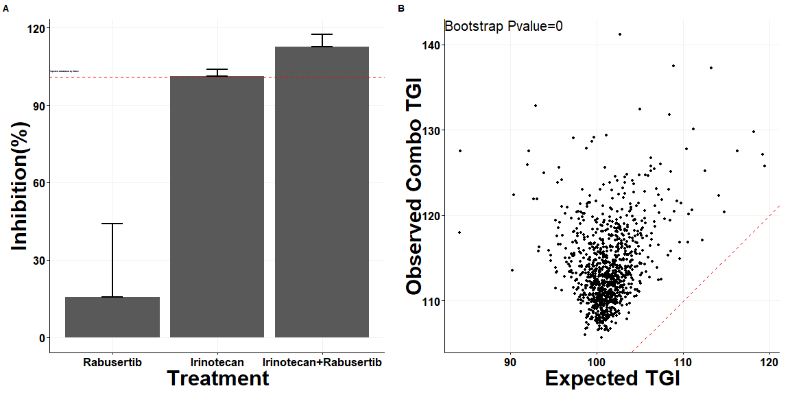
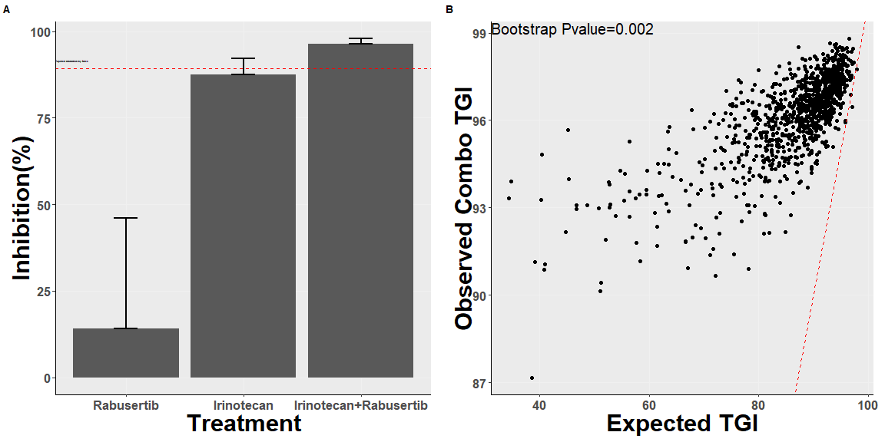
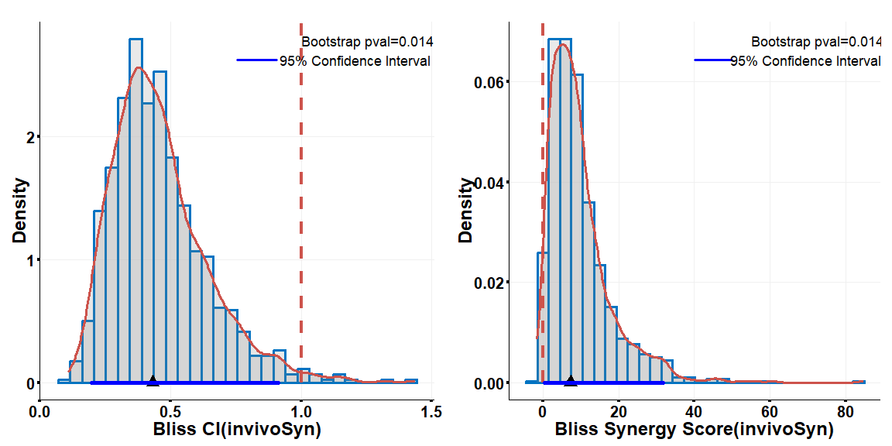

<!-- README.md is generated from README.Rmd. Please edit that file -->


# invivoSyn

<!-- badges: start -->
<!-- badges: end -->

The goal of invivoSyn is to evaluate synergy for in vivo tumor growth data. Synergy can be calculated based on TGI/AUC based drug effect or linear mixed model. For effect based efficacy, three reference models can be selected, which are HSA (Highest Single Agent), Bliss(Bliss Independence) or RA(Response Addivity).
P-values are calculated for both synergistic effect and antagonism effect.

## Shiny application

The bundled Shiny application accepts wide or long tumor-volume files, supports
multiple Combination arms with exact comparator mapping, and runs independent
Bliss or HSA TGI/AUC analyses for each Combination.

``` r
invivoSyn::run_invivoSyn_app()
```

For local development, load the package checkout first with
`devtools::load_all()`. For shinyapps.io deployment, install `invivoSyn` from a
reproducible remote source and verify dependencies with
`rsconnect::appDependencies("inst/shiny/invivoSyn")`.

## Installation

You can install the development version of invivoSyn from [GitHub](https://github.com/) with:

``` r
# install.packages("devtools")
devtools::install_github("maobinchen/invivoSyn")
```

## Example

This is a basic example which shows you how to do synergy calculation


``` r
library(invivoSyn)
tv <- read_tv(system.file("extdata", "test.csv", package = "invivoSyn"))
TGI_lst <- getTGI(tv,17)
bliss_synergy_TGI <- TGI_synergy(TGI_lst)
```

<div class="figure">

<p class="caption">plot of chunk example</p>
</div>

``` r
TGI_lst_RTV <- getTGI(tv,17,tv_var='RTV') #TGI defition from CombPDX paper
bliss_synergy_TGI_RTV <- TGI_synergy(TGI_lst_RTV)
```

<div class="figure">

<p class="caption">plot of chunk example</p>
</div>

``` r
#global_CI=global_CI_synergy(tv)
AUC_lst <- get_mAUCr(SNU_81, ci = 0.9, ci_type = "bca")
bliss_synergy_AUC <- AUC_synergy(AUC_lst)
```

<div class="figure">

<p class="caption">plot of chunk example</p>
</div>


